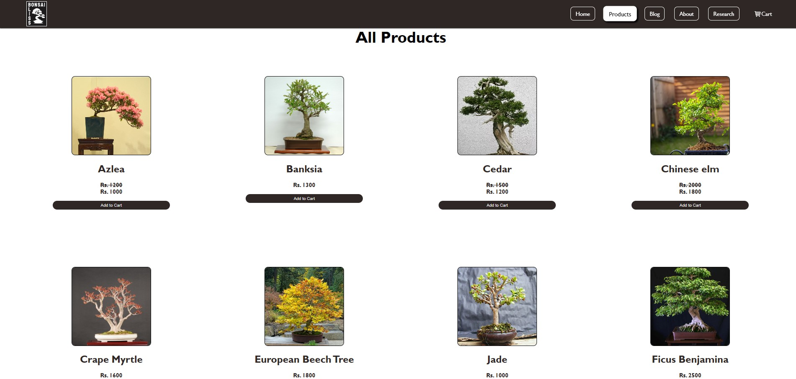

# 🌿 Bonsai Bliss

Welcome to **Bonsai Bliss**, an elegant online marketplace designed for bonsai enthusiasts and plant lovers. This static web application allows users to browse, explore, and purchase a diverse collection of premium bonsai trees and plants with a seamless, aesthetic user experience.

---

## 🛒 Overview

**Bonsai Bliss** is a front-end web project built to showcase a plant e-commerce platform. It features:

- 🌱 A responsive homepage with modern plant-themed design  
- 🪴 Custom product slider to highlight best-selling items  
- 🛍️ Shopping cart system using local storage  
- ✉️ Contact/feedback form with basic validation  

---

## 🎯 Purpose & Target Audience

- **Purpose**: To provide a serene and beautiful online platform for browsing and buying bonsai and other plants.
- **Target Audience**: Horticulture enthusiasts, gift shoppers, interior decorators, and anyone looking for botanical beauty.

---

## 💻 Technologies Used

- **HTML5** – For clean and semantic webpage structure  
- **CSS3** – For elegant styling, animations, and responsive design  
- **JavaScript** – For dynamic interactions (e.g., cart, form validation)

---

## 📸 Preview

### 🏠 Homepage


### 🪴 Product Page



> _More screenshots can be found in the `assets/images/` directory._

---

## 🚀 Installation & Setup

To run this project locally:

```bash
git clone https://github.com/ranjan-uprety/BonsaiBliss.git
cd BonsaiBliss
